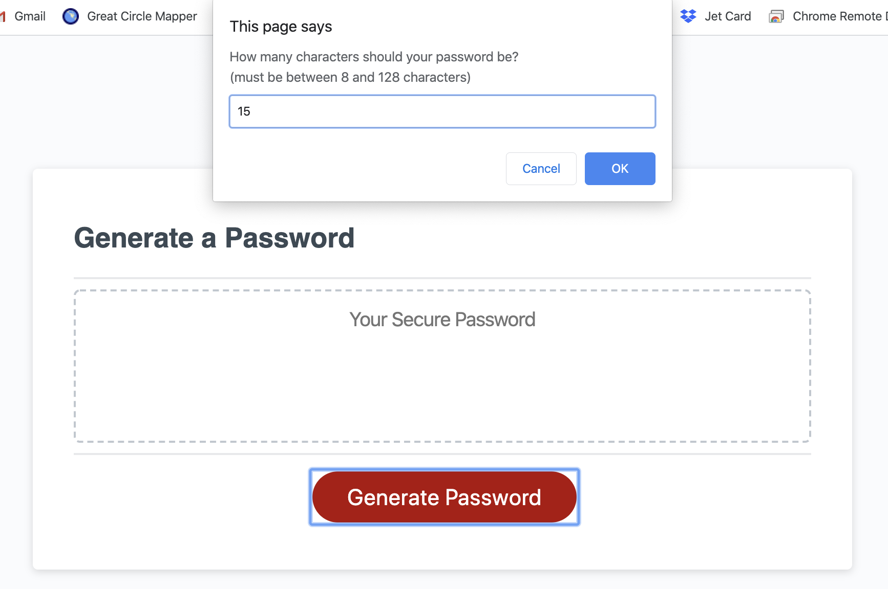
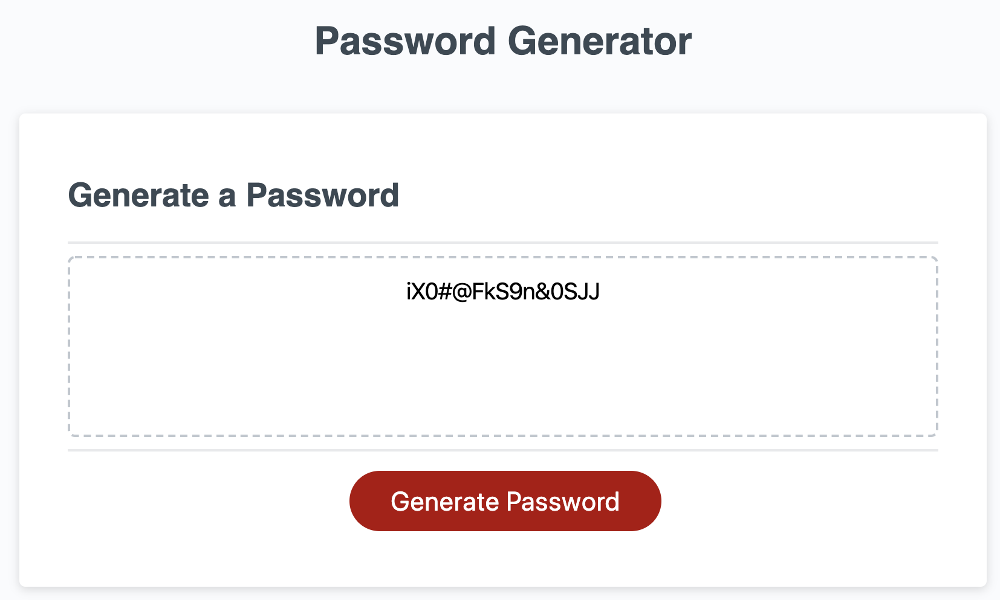

# Password Generator
The goal of this project is to create a random password based on the users preferred length and characters.

## Usage

Click 'Generate Password' to begin  
Choose a password length between 8 and 128 characters.   
Choose at least one of the following character types:  

lowercase letters  
uppercase letters  
numbers  
special characters  

## Links

Live: https://jkaplanis.github.io/password-generator/  
Github Repo: https://github.com/jkaplanis/password-generator

## Screenshots

  
